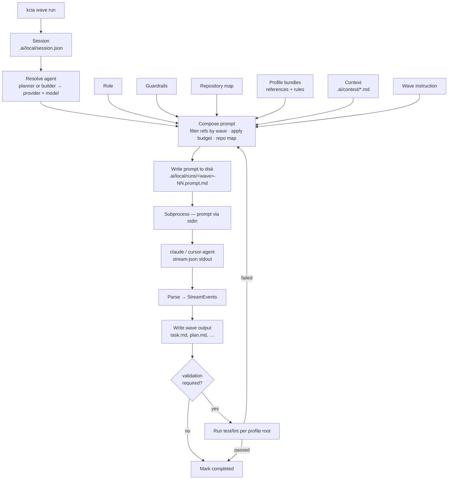

# kcia

**Control plane + CLI** that drives your existing agent tools (Claude Code, Cursor) through a
structured, auditable pipeline — without calling any LLM API directly.

## Requirements

- Python 3.11+
- `git`
- A provider CLI, **installed and logged in**, for each role you use

kcia never calls an LLM API. It shells out to the CLI you already have, so that CLI — and
its session — is a hard requirement, not an optional integration:

| Provider | Binary | Install | Log in | Check |
|---|---|---|---|---|
| Claude Code | `claude` | `npm i -g @anthropic-ai/claude-code` or `brew install --cask claude-code` | `claude auth login` | `claude auth status` |
| Cursor | `cursor-agent` | install Cursor, enable the CLI from the command palette | `cursor-agent login` | `cursor-agent status` |

The default setup uses **both**: `planner` on Claude Code and `builder` on Cursor. One CLI is
enough only if you point both roles at the same provider (`kcia agent set builder claude …`).
Billing is whatever those subscriptions already cost you — kcia adds none of its own.

**`kcia doctor` answers all of this for your machine**: Python and git, whether each provider
is installed and authenticated (and as whom), whether your configured agents can actually
run, and whether the repository is initialized. Run it first when anything looks wrong.

```
Providers
  ✓ claude: authenticated as you@example.com (pro)
  ! cursor: not installed
      Instala Cursor y habilita el CLI desde la paleta de comandos.

Agents
  ✓ planner: claude/claude-opus-5 (global)
  ✗ builder: cursor/composer-2.5 (global)
      `cursor` is not installed, so this role cannot run.
```

You do not need to remember to run it: `kcia wave run` performs the same check for the
configured roles **before the first wave**, and refuses to start with the install or login
hint. That matters because the builder's provider is not exercised until the fourth wave —
without the upfront check, three planner waves would burn tokens before a missing
`cursor-agent` surfaced.

## Install

One line:

```bash
curl -fsSL https://raw.githubusercontent.com/rendondeveloper/kcia/master/scripts/install.sh | bash
```

That clones kcia to `~/tools/kcia`, builds its virtualenv, installs the CLI, and links a
`kcia` shim into `~/.local/bin`. kcia is installed **from a git clone**, not with `pipx` —
the CLI needs `control-plane/` on disk next to `cli/` (see
[Why not `pipx install`](#why-not-pipx-install)). Keep `~/tools/kcia`: it is your
distribution copy, not a disposable checkout.

Override the defaults with environment variables if you want it elsewhere:

```bash
KCIA_HOME=~/src/kcia KCIA_BIN=~/bin curl -fsSL .../install.sh | bash
```

### Verify

```bash
kcia --version        # e.g. kcia 0.1.0
kcia profile list     # backend-dart, mobile-flutter, web-flutter
```

If `profile list` is empty, the CLI cannot find `control-plane/` — you are running a
`kcia` from somewhere else. Check `which kcia`; it should point at `~/.local/bin/kcia`.
If `~/.local/bin` was not already on your `PATH`, the installer appends it to your shell
rc and tells you to `source` it.

### Configure agents (once)

See what each provider offers, then pick:

```bash
kcia agent models              # every provider, its models, tier and what each is best for
kcia agent models claude       # one provider
kcia agent models --json       # same data, scriptable
kcia agent models --live       # ask the installed CLI and flag stale catalog entries

kcia agent set planner claude --model claude-opus-5
kcia agent set builder cursor --model composer-2.5
kcia agent show
```

Do this **before `kcia init`** — agents are what execute the waves, and `init` closes by
reporting which ones it will use (or how to pick them, when none are set).

Preferences are stored in `~/.config/kcia/config.yaml` and apply to every project unless
overridden per repo — see [Per-project models](#per-project-models).

Note that **Cursor uses its own model ids**, not Anthropic's: `composer-2.5`,
`claude-sonnet-5-thinking-high`, `auto`, and so on — plain `claude-sonnet-5` is not one of
them. `auto` is Cursor's default and lets it pick per request. The catalog in
`control-plane/providers/catalog.yaml` is curated by hand, so `kcia agent models --live`
compares it against `cursor-agent --list-models` and exits non-zero on drift.

### Per-project models

To use different agents in one repository, set them with `--scope repo` from inside it:

```bash
cd /path/to/your/project
kcia agent set planner claude --model claude-opus-5 --scope repo
kcia agent show                # the `origin` column shows repo / global / default
```

Resolution order, highest first:

| Origin | Where |
|---|---|
| `flag` | a `--provider` / `--model` flag on the command being run |
| `repo` | `<project>/.ai/local/agents.yaml` |
| `global` | `~/.config/kcia/config.yaml` |
| `default` | the provider catalog |

Note that `.ai/local/` is gitignored, so a repo-scoped choice is **yours on this machine**
— it does not travel with the repository. There is currently no committed, team-wide way to
pin models for a project; each person runs the `--scope repo` command in their own clone.

## Quickstart — first task in a project

> **Set your agents first.** Steps 1 and 2 are in that order on purpose: the agents are what
> actually run every wave, and they are *not* part of `kcia init`. Skip step 1 and the
> pipeline silently falls back to catalog defaults — you can burn a full run on a model you
> never chose. `kcia init` closes by printing the agents it will use, so check that line
> before starting a task. Already installed? `kcia agent show` tells you where you stand.

Run these from **inside the repository** you want kcia to work on:

```bash
cd /path/to/your/project

# 1. Choose who runs the waves — do this BEFORE init.
kcia agent models                # see what each provider offers
kcia agent set planner claude --model claude-opus-5
kcia agent set builder cursor --model composer-2.5

# 2. Detect technologies, write manifest, generate adapters (idempotent).
kcia init --yes                  # closes by reporting the agents it will use

# 3. Start a task.
kcia task init "fix the overflow on the profile screen"

# Optional: limit which packages drive active profiles.
kcia task init "fix the API" --scope packages/api

# 4. Inspect the pipeline.
kcia wave list

# 5. Run waves one at a time (or omit the wave id to run the next pending).
kcia wave run
kcia wave run understanding
kcia wave run --until analysis
kcia wave run --quiet            # no live progress line (CI, logs)

# 6. Review the plan, then let the build run.
kcia wave approve

# 7. Inspect progress and token usage.
kcia task show
kcia wave logs understanding
```

### The approval gate

The three planning waves run unattended, but `kcia wave run` **stops before
`implementation`** — the first wave allowed to touch code outside `.ai/`. It points at the
plan and waits:

```
Paused before `implementation` — the first wave that can change your code.

  Plan: /path/to/your/project/.ai/context/plan.md  (58 lines)

Open it and edit it directly if something is wrong — your changes go
into the builder's prompt. Then:
  kcia wave plan               print it here
  kcia wave approve            approve and continue
  kcia task inject "..."       add context, then re-run the planning wave
  kcia task abort              stop here
```

The plan is plain Markdown at `.ai/context/plan.md`. **Editing it during the pause works**:
prompts are composed when a wave runs, not when the plan was written, so whatever the file
says at `kcia wave approve` time is what the builder gets. That makes correcting a plan
cheaper than re-running the planning waves.

`kcia wave approve` records the decision **and continues the run** — one command, not two.
Use `--no-run` to only record it, `--note` to attach a reason, and `kcia wave plan` to
reprint the plan at any time. The paused run exits with code `2`, distinct from a real
failure (`1`), so scripts can tell "waiting for a human" from "broken".

For unattended runs, `kcia wave run --yes` skips the gate.

The gate is declarative, not hardcoded. It comes from `requires_approval` in
`control-plane/waves/waves.yaml`, so moving it — or adding a second one — is a data edit:

```yaml
  - id: implementation
    requires_approval: true
    approval_shows: plan.md
```

While a wave runs, a live status line reports which agent is working, on which provider and
model, and what it is doing right now:

```
⠹ implementation · builder · cursor/composer-2.5 — writing lib/device_list.dart · 2m14s · 7 tools · 12k tok
implementation · builder · cursor/composer-2.5 — completed (10m12s, 7 tool calls, 2 files written, 13k tokens)
```

`kcia wave run` closes with the total (`All waves completed in 14m35s.`), and `kcia task show`
breaks the time down per wave alongside the tokens.

It is drawn on stderr and refreshed in place, so piping or redirecting stdout is unaffected.
Off a TTY it degrades to one plain line per wave, and `--quiet` turns it off entirely.

`kcia init` writes `.ai/manifest.yaml`, composed profile bundles, provider adapters
(`CLAUDE.md`, `AGENTS.md`, `.cursor/rules/*.mdc`), and adds all generated paths to
`.gitignore`. Run it again after updating kcia — it only rewrites what changed
(`Already up to date` when nothing moved).

Use `--yes` in CI or non-interactive shells. Use `--no-gitignore` if you manage ignore
rules yourself.

Agent configuration (`kcia agent set`) is done once on your machine — see
[Configure agents](#configure-agents-once). Use `--scope repo` to override per repository
(written to `.ai/local/agents.yaml`, gitignored) — see
[Per-project models](#per-project-models).

## Updating

New versions land on `master`. Update **in your clone** (`~/tools/kcia`), never inside the
projects you work on.

### Routine update

Same one line as the install:

```bash
~/tools/kcia/scripts/install.sh update
```

Or, if the clone is gone or broken, from the network again:

```bash
curl -fsSL https://raw.githubusercontent.com/rendondeveloper/kcia/master/scripts/install.sh | bash -s update
```

The updater does a `git reset --hard origin/master` in the clone. That is intentional: the
clone is a distribution copy, not a place to edit — local changes there are discarded. Your
own projects are untouched.

### After updating — refresh your projects

Read `CHANGELOG.md` first. Two versions move independently:

| Version | Command | What it tracks |
|---|---|---|
| CLI | `kcia --version` | Python code, commands, runner |
| Control plane | `cat control-plane/VERSION` | Profiles, waves, guardrails, templates |

If the control plane version changed, regenerate guidance in each project:

```bash
cd /path/to/your/project
kcia init --yes          # idempotent — rewrites only what changed
```

Or, if you only need to refresh detection:

```bash
kcia profile detect
```

### Full reset (if something still looks wrong)

Rebuild the kcia environment from scratch:

```bash
rm -rf ~/tools/kcia/.venv
~/tools/kcia/scripts/install.sh update
```

The installer rebuilds the virtualenv when it is missing.

In a project where generated output looks stale:

```bash
cd /path/to/your/project
rm -rf .ai/generated .ai/cache
kcia init --yes
```

Never delete `.ai/manifest.yaml` or `.ai/profiles/` — those are yours.

## Uninstall

```bash
~/tools/kcia/scripts/install.sh uninstall
```

That removes the clone and its venv, the `kcia` shim, `~/.config/kcia` (agent preferences),
`~/.local/share/kcia` (installed profile packs), and the `PATH` line it added. The `.ai/`
directories in your projects are left alone.

Publishing a new version (maintainers only): [RELEASING.md](RELEASING.md).

## Why not `pipx install`

`pipx install ./cli` and
`pipx install "git+https://github.com/rendondeveloper/kcia.git#subdirectory=cli"` both
install the CLI but produce a **broken runtime**. `control-plane/` lives outside `cli/`, so
no Python build backend can bundle it into the wheel; `control_plane_root()` then resolves
to a path that does not exist and every command that needs profiles, waves, roles,
guardrails, or the provider catalog comes up empty.

Packaged installs will be supported once `kcia sync` lands (see [Status](#status)).

## Objective

kcia exists to give coding agents **the right guidance at the right moment**, while keeping
prompts as small as possible.

The guiding principle:

> **Python resolves what has a single verifiable answer** — which files exist, which profile
> owns a path, which command runs where, whether a test passed.
> **The model decides what depends on the concrete problem** — what is relevant, how to
> design the solution.

Concretely, kcia:

1. **Detects** the technologies in your repository and maps them to **profiles** (YAML +
   Markdown packs — no Python per technology).
2. **Composes** a prompt per pipeline step (**wave**) from guardrails, profile references,
   project context, and task state — filtering and budgeting what goes in so the model is
   not flooded with guidance it does not need yet.
3. **Runs** the provider CLI you already pay for (`claude`, `cursor-agent`) as a subprocess,
   with real permission restrictions and per-profile validation after implementation.
4. **Persists** everything on disk — prompts, outputs, token counts — so every step is
   inspectable and the planner → builder handoff is a file, not a conversation thread.

You install kcia **once** on your machine. Each project only gets a `.ai/` directory
(gitignored) when you run `kcia init`.

## Concepts

| Concept | What it is |
|---|---|
| **Profile** | A technology pack: detection rules, shell commands, coding references, boolean rules. |
| **Agent** | One of two roles — `planner` or `builder` — each mapped to a `(provider, model)` pair. |
| **Wave** | One of five sequential pipeline steps, from understanding through documentation. |
| **Task** | A unit of work started with `kcia task init`, tracked in `.ai/local/session.json`. |

## Where kcia lives

| | Location | Committed? |
|---|---|---|
| The CLI and control plane | your clone, e.g. `~/tools/kcia` | separate repo |
| Agent preferences (provider, model, effort) | `~/.config/kcia/config.yaml` | no — global to you |
| Installed profile packs | `~/.local/share/kcia/packs/` | no |
| Per-repo state | `<your project>/.ai/` | partly — see below |

Inside a project you work on, **nothing kcia writes is committed**. `kcia init` adds it
all to that project's `.gitignore` for you:

```gitignore
# kcia — generated, do not commit
.ai/
CLAUDE.md
AGENTS.md
.cursor/rules/
```

So a teammate cloning your project sees no kcia files at all; they run `kcia init` once
and get their own. Nothing to configure, nothing to keep in sync by hand.

This includes `.ai/profiles/`. Profiles you write there are local to your working copy
and do not travel with the project — to share a profile with your team, publish it as a
profile pack and install it with `kcia profile add`.

Nothing from kcia's own dependency tree is installed into your project, and your project
needs no Python.

## How it works

kcia never talks to an LLM API. It drives the **CLI you already have installed and pay
for** — `claude` or `cursor-agent` — as a subprocess: it composes a prompt on disk, pipes
it into the CLI's stdin, and parses the CLI's structured stdout back into normalized
events. Your subscription, your models, your machine.



### End-to-end flow

```
your project/          ~/tools/kcia/              provider CLI
─────────────          ─────────────              ────────────
kcia init         →    detect + control-plane  →  (no model yet)
kcia task init    →    session.json
kcia wave run     →    compose prompt        →    claude / cursor-agent
                       write prompt.md            ↓
                       parse stdout         ←    stream-json events
                       write plan.md
                       run dart test / flutter test
```

### 1. Profiles decide which guidance applies where

A **profile** is a data package for one technology: detection rules, shell commands,
coding references, and boolean rules. `kcia init` runs detection over the repository and
records the result in `.ai/manifest.yaml`, mapping each profile to the paths it owns:

```yaml
profiles:
  - id: backend-dart
    roots: ["packages/api/**", "packages/shared/**"]
  - id: mobile-flutter
    roots: ["packages/app_mobile/**"]
```

Several profiles can be active at once, and a file can match more than one — all matches
apply, deliberately. Profiles inherit through `extends` (max 3 levels): `mobile-flutter`
extends `_dart-core`, so it gets the shared Dart guidance plus its own delta. References
concatenate parent-first; commands and rules merge with the child winning.

Adding a technology is a directory of YAML and Markdown. No Python. Detection is written
in a small declarative DSL — 14 leaf predicates (`file_exists`, `yaml_any_key`,
`file_contains`, …) plus `all` / `any` / `not`:

```yaml
detect:
  - when:
      all:
        - file_exists: "pubspec.yaml"
        - yaml_absent: { file: "pubspec.yaml", path: "dependencies.flutter" }
    confidence: high
    evidence: "pubspec.yaml with no Flutter SDK dependency"
```

### 2. What `kcia init` puts in your project

| Path | Contents |
|---|---|
| `.ai/manifest.yaml` | active profiles, their roots, detection evidence |
| `.ai/generated/profiles/<id>/references.md` | the profile's references, concatenated parent-first with the declaring profile noted |
| `.ai/generated/profiles/<id>/profile.md` | commands, rules, inheritance chain, validation requirements |
| `.ai/context/project.md` | project description injected into every prompt |
| `CLAUDE.md`, `AGENTS.md` | adapters listing active profiles and authority order |
| `.cursor/rules/NN-<id>.mdc` | one Cursor rule per profile, with `globs` scoped to that profile's roots |

All of it is gitignored and regenerable — rerun `kcia init` any time.

### 3. A task moves through five waves

`kcia task init "<prompt or ticket>"` creates `.ai/local/session.json`, holding the task,
the active profiles, and per-wave state (`pending`, `running`, `completed`, `failed`,
`skipped`, `awaiting_input`). The waves are **data**, declared in
`control-plane/waves/waves.yaml`:

| # | Wave | Agent | Edits | Writes |
|---|---|---|---|---|
| 1 | `understanding` | planner | no | `.ai/context/task.md` |
| 2 | `analysis` | planner | no | `.ai/context/plan.md` |
| 3 | `documentation-init` | planner | `.ai/**` | `current.md`, `decisions.md` |
| 4 | `implementation` | builder | `**` | your code — validation **required** |
| 5 | `documentation-final` | builder | `.ai/**` | `milestones.md` |

Each wave declares `requires`, so `kcia wave run analysis` fails if `understanding` is not
completed (override with `--force`). A machine-wide lock keyed on pid ensures one wave at a
time; a stale lock left by a dead process is cleared automatically.

The **planner → builder handoff is a file**: the planner writes `plan.md`, and the builder's
prompt includes it verbatim. The two roles can run on different providers — plan with
Claude Opus, implement with Cursor — because the contract between them is on disk, not in a
conversation.

### 4. How the prompt is composed

`waves/prompts.py` assembles one string in a **fixed order**. Nothing is hidden — the exact
text sent is written to `.ai/local/runs/<wave>-NN.prompt.md` on every run, including
retries. Token usage per section is tracked internally for budgeting decisions.

| # | Section | Source |
|---|---|---|
| 1 | Role | `control-plane/agents/roles.yaml` |
| 2 | Guardrails | `control-plane/guardrails/*` (+ `reasoning-limits.md` on `implementation` only) |
| 3 | Project context | `.ai/context/project.md` |
| 4 | Repository map | precomputed from `manifest.yaml` — packages, profiles, test/lint commands |
| 5 | Profile bundles | references (filtered) + boolean rules, per active profile |
| 6 | Task context | `.ai/context/task.md` (+ `ticket.md` in ticket mode) |
| 7 | Previous wave output | `plan.md` on `implementation` and `documentation-final` |
| 8 | Validation error | injected on retry with the failing command's real output |
| 9 | Injections | anything added with `kcia task inject "<text>"` |
| 10 | Wave instruction | `control-plane/waves/prompts/<wave>.md.j2` |
| 11 | Output format | fixed footer |
| 12 | Context budget | only when references were dropped to fit the budget |

**Reference filtering.** Each reference file carries tags (`coding`, `testing`,
`architecture`, …). Each wave declares which tags it wants via `reference_tags` in
`waves.yaml`. The `understanding` wave requests `[coding, monorepo]`; `implementation`
requests `[coding, testing, validation, api, data, web, accessibility]`. Waves with
`reference_tags: []` inject rules but no reference files.

**Context budget.** When the composed prompt would exceed `budget.max_prompt_tokens`
(default 120 000, overridable in `~/.config/kcia/config.yaml` → `preferences.max_prompt_tokens`),
whole reference files are dropped tag-by-tag following `budget.drop_order`. A
`## Context budget` footer lists what was omitted. Guardrails are never truncated.

**Task scope.** `kcia task init --scope packages/api` limits which manifest roots drive
profile resolution, so a task that only touches the API package does not pull in Flutter
profile bundles.

Measured on `tests/fixtures/repos/melos_mono` with one active profile (`backend-dart`):

| Metric | Before optimization | After |
|---|---|---|
| Tokens per task (5 waves) | ~14 834 | ~12 655 (~15% lower) |
| `understanding` wave | ~2 958 | ~2 482 (~16% lower) |

Guardrails are plain Markdown in the control plane — edit them and the next `kcia wave run`
picks up the change with no reinstall.

### 5. How Python talks to the model CLIs

`providers/runner.py` is provider-agnostic. It asks the adapter to build an argv, spawns it
with `subprocess.Popen`, writes the prompt to **stdin** (never as an argument — prompts are
tens of kilobytes), and reads stdout line by line:

```python
cmd = adapter.build_command(req)          # provider-specific argv
process = subprocess.Popen(cmd, stdin=PIPE, stdout=PIPE, stderr=PIPE, cwd=req.cwd)
process.stdin.write(req.prompt); process.stdin.close()
for line in process.stdout:               # streamed, not buffered to completion
    events = adapter.parse_stream_line(line, state)
```

`providers/claude.py` builds:

```
claude --print --output-format stream-json --model <model>
       --permission-mode <mode> --verbose --include-partial-messages
       --add-dir <repo> [--effort low|medium|max]
```

`providers/cursor.py` builds the `cursor-agent --print --output-format stream-json`
equivalent. Each adapter translates its own JSON dialect into the **same eight events** —
`TextDelta`, `ToolCallStart`, `ToolCallEnd`, `FileRead`, `FileWrite`, `UsageUpdate`,
`TurnEnd`, `ProviderError`. The wave runner only ever sees those, so there is no
`if provider == "claude"` anywhere outside `providers/`. Adding a provider is a new adapter
module plus a catalog entry; the registry also discovers third-party adapters through the
`kcia.providers` entry point group.

The runner supervises the subprocess while it works:

- **stderr on a separate thread**, so a chatty CLI cannot deadlock the pipe
- **idle timeout** (default 180s without a line) kills the process
- **stuck warning** at 90s of silence
- **reasoning guardrails** — optional caps on tool calls and files read; exceeding one kills
  the run and reports `cancel_reason`
- malformed or non-JSON lines return `[]` rather than raising, so a stray banner cannot
  crash a wave

Tokens, tool-call counts, and the files read and written are accumulated from the events and
persisted to the session.

### 6. Permissions

The wave's `allow_edits` becomes a real restriction on the provider CLI, not a polite
request in the prompt:

| `allow_edits` | Claude Code invocation |
|---|---|
| `false` (planner waves) | `--permission-mode default --disallowed-tools Edit Write NotebookEdit` |
| `true` | `--permission-mode bypassPermissions` |
| `true` with an explicit tool allowlist | `--permission-mode acceptEdits --allowed-tools …` |

So the planner **cannot** modify your code even if the model decides to try.

### 7. Validation is per profile, never global

After `implementation`, kcia builds a validation plan:

1. take the session's active profiles, or resolve them from the touched paths against the
   manifest `roots`
2. expand through the manifest's `dependencies` — touching `packages/shared/**` can require
   validating every profile that consumes it
3. take each profile's `validation.required_commands` and resolve the actual command
   (profile → `command_overrides` → manifest overrides)
4. deduplicate by `(cwd, command)` and order lint before test before build

Each command runs **in its own profile's root**. This is the point: `flutter test` in a pure
Dart package fails, so the test command is resolved per profile and never assumed globally.
On failure only the failing profile is retried, up to 3 times, with the command's real
output injected back into the builder's prompt. Profiles that already passed are never
re-run.

### 8. Everything is auditable

| File | What it tells you |
|---|---|
| `.ai/local/runs/<wave>-NN.prompt.md` | the exact prompt sent, including on each retry |
| `.ai/local/session.json` | per-wave status, agent, provider, model, tokens, tool calls |
| `.ai/context/*.md` | the artifacts the waves produced |
| `.ai/generated/profiles/` | the guidance that was in play, with each piece attributed |

### Token usage

Token counts come from the provider's own `UsageUpdate` events and are accumulated per
wave — including across validation retries, which invoke the provider more than once.

```
$ kcia wave list
1. understanding	completed	planner (claude/claude-opus-5)	18.4k tokens
2. analysis	completed	planner (claude/claude-opus-5)	22.0k tokens
3. documentation-init	pending	planner (claude/claude-opus-5)

total: 40.4k tokens

$ kcia task show
tokens: 40.4k
  input:  36.0k
  output: 4.0k
  cached: 20.0k (read from cache)
tool calls: 43
provider calls: 2
```

kcia does **not** report cost, and cannot report how much of your subscription quota is
left. Neither `claude` nor `cursor-agent` exposes quota or usage limits in a scriptable
way — Claude Code shows it only inside the interactive TUI, and `cursor-agent about`
reports the subscription tier but no consumption. Token counts are the honest ceiling of
what kcia can tell you from headless invocations.

### Known gaps

Being honest about what the code does not yet do:

- **`edit_scope` is not enforced.** Waves declare it (`documentation-init` is meant to be
  confined to `.ai/**`), but the runner does not translate it into a tool restriction — a
  wave with `allow_edits: true` currently gets full write access.
- **Workflow files are not injected** into prompts yet, only references and rules.
- **Sessions are not resumed** across waves — every wave is a fresh invocation, and the
  handoff happens through files.
- **The runner does not track which files the wave actually changed.** It passes the
  repository root as the touched path, so validation falls back to the session's active
  profiles rather than narrowing to the edited ones. The per-path resolution above works
  and is tested; the runner just does not feed it a precise list yet.

## Status

**Implemented and usable**

| Area | Commands / features |
|---|---|
| Project setup | `kcia init` — detection, manifest, bundles, adapters, gitignore |
| Profiles | `profile list/show/detect/validate/scaffold`, inheritance, packs, resolution |
| Agents | `agent set/show/swap` — Claude and Cursor adapters |
| Tasks | `task init/show/inject/abort` — with `--scope` for path-limited profiles |
| Waves | `wave list/run/approve/plan/retry/skip/logs` — session, lock, prompt composition, validation |
| Diagnostics | `doctor` — toolchain, provider install and auth, agent and repo readiness |

**Not yet implemented** — these commands exit 1: `kcia sync`, `kcia ask`, `kcia branch`,
`kcia auth`, `kcia mcp`.
