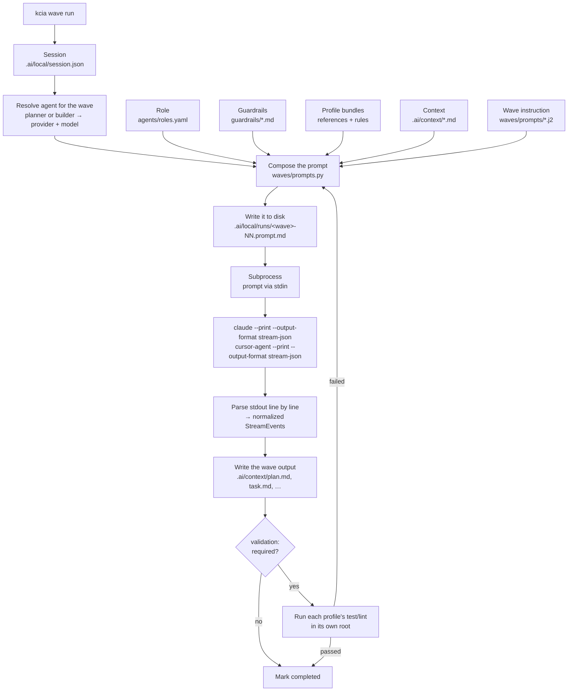

# kcia

Control plane and CLI for development agents (Claude Code, Cursor, and future providers).

## Concepts

- **Profiles** — extensible data packages that declare detection rules, commands, and coding guidance per technology.
- **Agents** — two roles (`planner`, `builder`), each mapped to a `(provider, model)` pair.
- **Waves** — five sequential pipeline steps from understanding through documentation.

## Requirements

- Python 3.11+
- `git`
- At least one provider CLI: `claude` (Claude Code) or `cursor-agent` (Cursor)

## Install

You install kcia **once, globally**. You do not install it into each project you work
on — see [Where kcia lives](#where-kcia-lives) below.

**1. Clone the repository.** Keep the clone; it is not disposable (see
[Why not `pipx install`](#why-not-pipx-install)).

```bash
git clone https://github.com/rendondeveloper/kcia.git ~/tools/kcia
cd ~/tools/kcia
```

**2. Create the virtualenv and install the CLI in editable mode.**

```bash
python3 -m venv .venv
.venv/bin/pip install -e "./cli[dev]"
```

**3. Put the CLI on your PATH.**

```bash
echo 'export PATH="$HOME/tools/kcia/.venv/bin:$PATH"' >> ~/.zshrc
source ~/.zshrc
```

**4. Verify.**

```bash
kcia --version        # kcia 0.1.0
kcia profile list     # backend-dart / mobile-flutter / web-flutter
```

If `profile list` prints nothing, the CLI cannot find `control-plane/` — you are running
a copy installed outside the clone. Redo step 2 from inside the clone.

### Why not `pipx install`

`pipx install ./cli` and `pipx install "git+https://github.com/rendondeveloper/kcia.git#subdirectory=cli"`
both install the CLI but produce a **broken runtime**. `control-plane/` lives outside
`cli/`, so no Python build backend can bundle it into the wheel; `control_plane_root()`
then resolves to a path that does not exist and every command that needs profiles,
waves, roles, guardrails, or the provider catalog comes up empty.

Keep the clone. The editable install above keeps `control-plane/` on disk where the CLI
can find it. Packaged installs will be supported once `kcia sync` lands (see Status).

## Updating

New versions are published to `master`. Updating is done **in your clone**, never in the
projects you use kcia on.

```bash
cd ~/tools/kcia

# 1. Take master exactly as published, discarding local changes.
git fetch origin
git reset --hard origin/master
git clean -fd

# 2. Reinstall so the CLI picks up the new code.
.venv/bin/pip install -e "./cli[dev]" --force-reinstall --no-deps

# 3. Confirm.
kcia --version
kcia profile list
```

`git reset --hard` discards anything you changed inside the clone. That is intended: the
clone is a distribution copy, not a place to edit. Your own projects are untouched.

Check `CHANGELOG.md` after updating. Two versions move independently: the CLI version
(`kcia --version`) and the control plane (`control-plane/VERSION` — profiles, waves,
templates). If the control plane changed, re-run detection in each project to pick up the
new guidance:

```bash
cd /path/to/your/project
kcia profile detect
```

### Full reset

If the CLI still misbehaves after updating, rebuild the environment from scratch:

```bash
cd ~/tools/kcia
find . -name __pycache__ -type d -prune -exec rm -rf {} +
rm -rf .venv
python3 -m venv .venv
.venv/bin/pip install -e "./cli[dev]"
kcia --version
```

In a project where generated output looks stale:

```bash
cd /path/to/your/project
rm -rf .ai/generated .ai/cache
kcia profile detect
```

Never delete `.ai/manifest.yaml` or `.ai/profiles/` — those are yours and are committed.

### Uninstall

```bash
rm -rf ~/tools/kcia                  # the clone and its venv
rm -rf ~/.config/kcia                # agent preferences
rm -rf ~/.local/share/kcia           # installed profile packs
# then remove the PATH line from ~/.zshrc
```

Publishing a new version (maintainers only): [RELEASING.md](RELEASING.md).

## Where kcia lives

| | Location | Committed? |
|---|---|---|
| The CLI and control plane | your clone, e.g. `~/tools/kcia` | separate repo |
| Agent preferences (provider, model, effort) | `~/.config/kcia/config.yaml` | no — global to you |
| Installed profile packs | `~/.local/share/kcia/packs/` | no |
| Per-repo state | `<your project>/.ai/` | partly — see below |

Inside a project you work on, **nothing kcia writes is committed**. `kcia init` adds it
all to that project's `.gitignore` for you:

```gitignore
# kcia — generated, do not commit
.ai/
CLAUDE.md
AGENTS.md
.cursor/rules/
```

So a teammate cloning your project sees no kcia files at all; they run `kcia init` once
and get their own. Nothing to configure, nothing to keep in sync by hand.

This includes `.ai/profiles/`. Profiles you write there are local to your working copy
and do not travel with the project — to share a profile with your team, publish it as a
profile pack and install it with `kcia profile add`.

Nothing from kcia's own dependency tree is installed into your project, and your project
needs no Python.

## Quickstart

Run kcia from inside the project you want it to work on:

```bash
cd /path/to/your/project

kcia init                                        # detect, generate, gitignore
kcia agent set planner claude --model claude-opus-5
kcia agent set builder cursor --model claude-sonnet-5
kcia agent show

kcia task init "fix the overflow on the profile screen"
kcia wave list
kcia wave run                                    # runs the next pending wave
```

`kcia init` detects the technologies in the repository, writes `.ai/manifest.yaml`, the
composed profile bundles, and the provider adapters (`CLAUDE.md`, `AGENTS.md`,
`.cursor/rules/*.mdc`), and adds all of it to `.gitignore`. It is idempotent: run it again
after updating kcia and it rewrites only what changed. Use `--yes` in CI or non-interactive
shells, and `--no-gitignore` if you would rather manage the ignore rules yourself.

`kcia agent set` without `--scope repo` writes to `~/.config/kcia/config.yaml` and applies
to every project. Use `--scope repo` to override the choice for one repository only
(written to `.ai/local/agents.yaml`, gitignored).

## How it works

kcia never talks to an LLM API. It drives the **CLI you already have installed and pay
for** — `claude` or `cursor-agent` — as a subprocess: it composes a prompt on disk, pipes
it into the CLI's stdin, and parses the CLI's structured stdout back into normalized
events. Your subscription, your models, your machine.



### 1. Profiles decide which guidance applies where

A **profile** is a data package for one technology: detection rules, shell commands,
coding references, and boolean rules. `kcia init` runs detection over the repository and
records the result in `.ai/manifest.yaml`, mapping each profile to the paths it owns:

```yaml
profiles:
  - id: backend-dart
    roots: ["packages/api/**", "packages/shared/**"]
  - id: mobile-flutter
    roots: ["packages/app_mobile/**"]
```

Several profiles can be active at once, and a file can match more than one — all matches
apply, deliberately. Profiles inherit through `extends` (max 3 levels): `mobile-flutter`
extends `_dart-core`, so it gets the shared Dart guidance plus its own delta. References
concatenate parent-first; commands and rules merge with the child winning.

Adding a technology is a directory of YAML and Markdown. No Python. Detection is written
in a small declarative DSL — 14 leaf predicates (`file_exists`, `yaml_any_key`,
`file_contains`, …) plus `all` / `any` / `not`:

```yaml
detect:
  - when:
      all:
        - file_exists: "pubspec.yaml"
        - yaml_absent: { file: "pubspec.yaml", path: "dependencies.flutter" }
    confidence: high
    evidence: "pubspec.yaml with no Flutter SDK dependency"
```

### 2. What `kcia init` puts in your project

| Path | Contents |
|---|---|
| `.ai/manifest.yaml` | active profiles, their roots, detection evidence |
| `.ai/generated/profiles/<id>/references.md` | the profile's references, concatenated parent-first with the declaring profile noted |
| `.ai/generated/profiles/<id>/profile.md` | commands, rules, inheritance chain, validation requirements |
| `.ai/context/project.md` | project description injected into every prompt |
| `CLAUDE.md`, `AGENTS.md` | adapters listing active profiles and authority order |
| `.cursor/rules/NN-<id>.mdc` | one Cursor rule per profile, with `globs` scoped to that profile's roots |

All of it is gitignored and regenerable — rerun `kcia init` any time.

### 3. A task moves through five waves

`kcia task init "<prompt or ticket>"` creates `.ai/local/session.json`, holding the task,
the active profiles, and per-wave state (`pending`, `running`, `completed`, `failed`,
`skipped`, `awaiting_input`). The waves are **data**, declared in
`control-plane/waves/waves.yaml`:

| # | Wave | Agent | Edits | Writes |
|---|---|---|---|---|
| 1 | `understanding` | planner | no | `.ai/context/task.md` |
| 2 | `analysis` | planner | no | `.ai/context/plan.md` |
| 3 | `documentation-init` | planner | `.ai/**` | `current.md`, `decisions.md` |
| 4 | `implementation` | builder | `**` | your code — validation **required** |
| 5 | `documentation-final` | builder | `.ai/**` | `milestones.md` |

Each wave declares `requires`, so `kcia wave run analysis` fails if `understanding` is not
completed (override with `--force`). A machine-wide lock keyed on pid ensures one wave at a
time; a stale lock left by a dead process is cleared automatically.

The **planner → builder handoff is a file**: the planner writes `plan.md`, and the builder's
prompt includes it verbatim. The two roles can run on different providers — plan with
Claude Opus, implement with Cursor — because the contract between them is on disk, not in a
conversation.

### 4. How the prompt is composed

`waves/prompts.py` assembles one string in a fixed order. Nothing is hidden; the exact text
sent is written to `.ai/local/runs/<wave>-NN.prompt.md` on every run, including retries.

1. **Role** — from `control-plane/agents/roles.yaml`, the `expected_outputs` for `planner`
   or `builder`
2. **Guardrails** — `policies.yaml`, `input-filter.md`, `tool-control.md`,
   `output-validation.md`, plus `reasoning-limits.md` on the `implementation` wave only
3. **Project context** — `.ai/context/project.md`
4. **Profile bundles** — for each active profile: its references (parent-first through the
   inheritance chain), then its boolean rules
5. **Task context** — `.ai/context/task.md`, plus `ticket.md` in ticket mode
6. **Previous wave output** — `plan.md`, on `implementation` and `documentation-final`
7. **Validation error** — on a retry, the failing command's actual output
8. **Injections** — anything added with `kcia task inject "<text>"`
9. **Wave instruction** — rendered from `control-plane/waves/prompts/<wave>.md.j2`
10. **Output format**

Guardrails are plain Markdown files in the control plane, read and inlined at composition
time. Editing one changes agent behavior on the next run with no code change and no
reinstall.

### 5. How Python talks to the model CLIs

`providers/runner.py` is provider-agnostic. It asks the adapter to build an argv, spawns it
with `subprocess.Popen`, writes the prompt to **stdin** (never as an argument — prompts are
tens of kilobytes), and reads stdout line by line:

```python
cmd = adapter.build_command(req)          # provider-specific argv
process = subprocess.Popen(cmd, stdin=PIPE, stdout=PIPE, stderr=PIPE, cwd=req.cwd)
process.stdin.write(req.prompt); process.stdin.close()
for line in process.stdout:               # streamed, not buffered to completion
    events = adapter.parse_stream_line(line, state)
```

`providers/claude.py` builds:

```
claude --print --output-format stream-json --model <model>
       --permission-mode <mode> --verbose --include-partial-messages
       --add-dir <repo> [--effort low|medium|max]
```

`providers/cursor.py` builds the `cursor-agent --print --output-format stream-json`
equivalent. Each adapter translates its own JSON dialect into the **same eight events** —
`TextDelta`, `ToolCallStart`, `ToolCallEnd`, `FileRead`, `FileWrite`, `UsageUpdate`,
`TurnEnd`, `ProviderError`. The wave runner only ever sees those, so there is no
`if provider == "claude"` anywhere outside `providers/`. Adding a provider is a new adapter
module plus a catalog entry; the registry also discovers third-party adapters through the
`kcia.providers` entry point group.

The runner supervises the subprocess while it works:

- **stderr on a separate thread**, so a chatty CLI cannot deadlock the pipe
- **idle timeout** (default 180s without a line) kills the process
- **stuck warning** at 90s of silence
- **reasoning guardrails** — optional caps on tool calls and files read; exceeding one kills
  the run and reports `cancel_reason`
- malformed or non-JSON lines return `[]` rather than raising, so a stray banner cannot
  crash a wave

Tokens, tool-call counts, and the files read and written are accumulated from the events and
persisted to the session.

### 6. Permissions

The wave's `allow_edits` becomes a real restriction on the provider CLI, not a polite
request in the prompt:

| `allow_edits` | Claude Code invocation |
|---|---|
| `false` (planner waves) | `--permission-mode default --disallowed-tools Edit Write NotebookEdit` |
| `true` | `--permission-mode bypassPermissions` |
| `true` with an explicit tool allowlist | `--permission-mode acceptEdits --allowed-tools …` |

So the planner **cannot** modify your code even if the model decides to try.

### 7. Validation is per profile, never global

After `implementation`, kcia builds a validation plan:

1. take the session's active profiles, or resolve them from the touched paths against the
   manifest `roots`
2. expand through the manifest's `dependencies` — touching `packages/shared/**` can require
   validating every profile that consumes it
3. take each profile's `validation.required_commands` and resolve the actual command
   (profile → `command_overrides` → manifest overrides)
4. deduplicate by `(cwd, command)` and order lint before test before build

Each command runs **in its own profile's root**. This is the point: `flutter test` in a pure
Dart package fails, so the test command is resolved per profile and never assumed globally.
On failure only the failing profile is retried, up to 3 times, with the command's real
output injected back into the builder's prompt. Profiles that already passed are never
re-run.

### 8. Everything is auditable

| File | What it tells you |
|---|---|
| `.ai/local/runs/<wave>-NN.prompt.md` | the exact prompt sent, including on each retry |
| `.ai/local/session.json` | per-wave status, agent, provider, model, tokens, tool calls |
| `.ai/context/*.md` | the artifacts the waves produced |
| `.ai/generated/profiles/` | the guidance that was in play, with each piece attributed |

### Known gaps

Being honest about what the code does not yet do:

- **`edit_scope` is not enforced.** Waves declare it (`documentation-init` is meant to be
  confined to `.ai/**`), but the runner does not translate it into a tool restriction — a
  wave with `allow_edits: true` currently gets full write access.
- **No context budget.** The plan calls for truncating low-priority references past a token
  threshold; prompts are currently assembled in full.
- **Workflow files are not injected** into prompts yet, only references and rules.
- **Sessions are not resumed** across waves — every wave is a fresh invocation, and the
  handoff happens through files.
- **The runner does not track which files the wave actually changed.** It passes the
  repository root as the touched path, so validation falls back to the session's active
  profiles rather than narrowing to the edited ones. The per-path resolution above works
  and is tested; the runner just does not feed it a precise list yet.

## Status

Implemented and usable: `kcia init` (detection, manifest, bundles, adapters, gitignore),
profiles (detection, inheritance, packs, resolution), providers (Claude and Cursor
adapters, agent configuration), and the wave engine (session, lock, prompt composition,
multi-profile validation).

Not yet implemented — these commands exit 1: `kcia doctor`, `kcia sync`, `kcia ask`,
`kcia branch`, `kcia auth`, `kcia mcp`.
